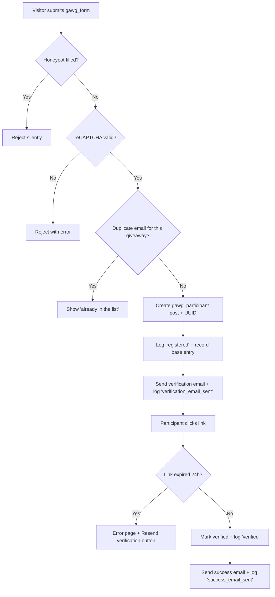
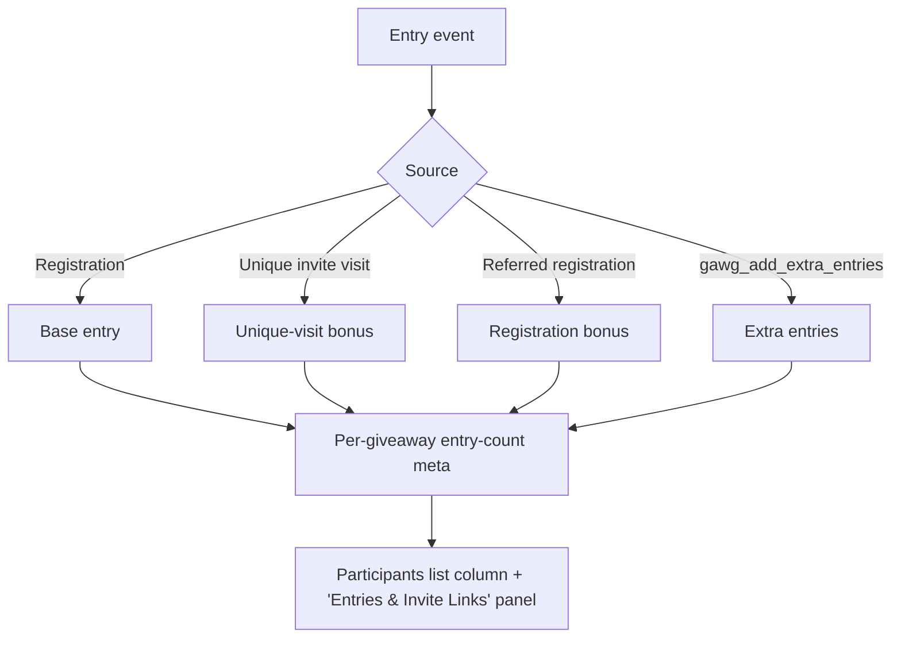
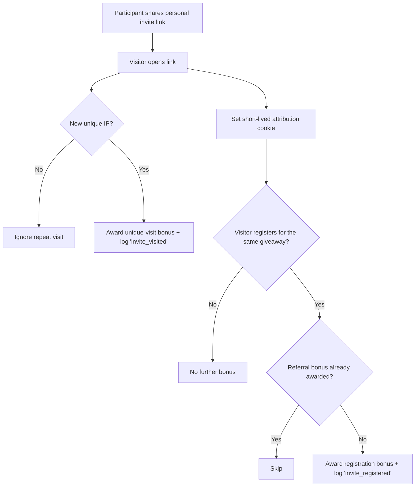
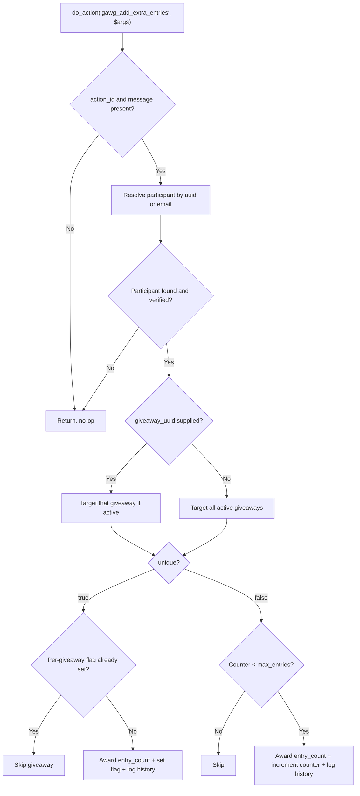
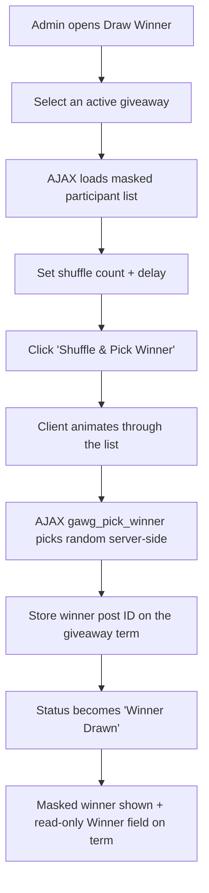
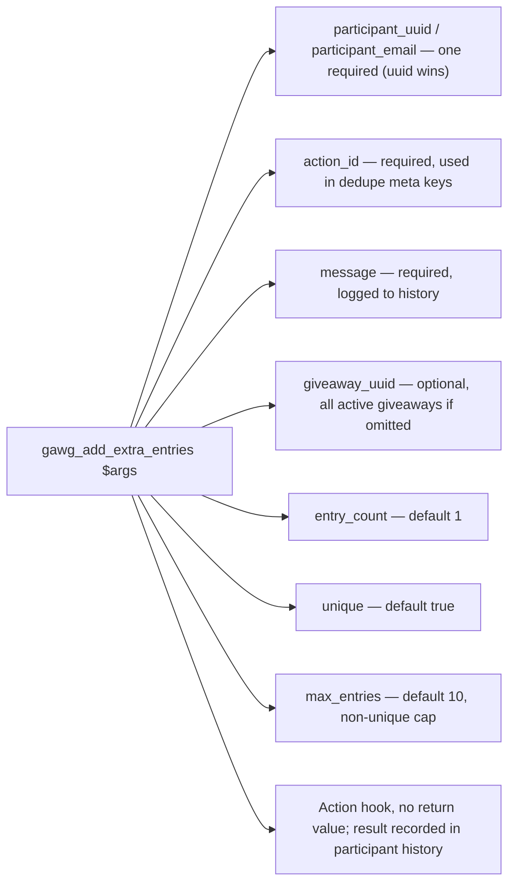
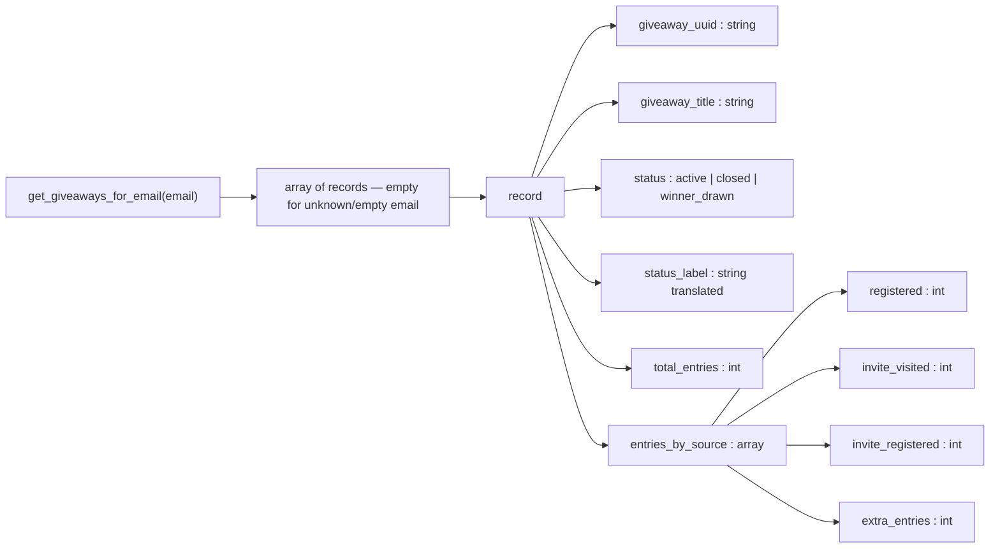
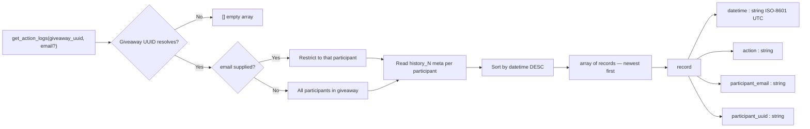

# GAWG — GiveAway Winner Generator

## What is it?
A WordPress plugin for running giveaways: create a giveaway entry, collect participant UUIDs via external forms or links, and pick a winner at random.

## Who's it for?
Generally, it's for me; it's a weekend project that is both useful and interesting.  
It could be useful for anyone running small giveaways on a WordPress site without needing a third-party service.

## What it does
- **Giveaway taxonomy** — each giveaway is a custom taxonomy term (`gawg_giveaway`) with a unique reference UUID, used to group and identify a giveaway campaign.
- **Participant post type** — each participant is a WordPress post (`gawg_participant`) with a title and its own unique reference UUID for external identification.
- **Auto-generated UUIDs** — a v4 UUID is created automatically for both giveaway terms (on save) and participant posts (on publish), displayed in edit screens for easy copying.
- **`[gawg_form]` shortcode** — embeds an AJAX entry form on any page or post; collects an email address, optionally links to the giveaway rules (via `rules_url` or `rules_post_id`), prevents duplicate entries per giveaway, and displays a configurable HTML success message (`success_message`).
- **`gawg/form` Gutenberg block** — a dynamic block that wraps the `[gawg_form]` shortcode; configure the giveaway and rules URL from the block's Inspector Controls panel and see a live server-side preview in the editor.
- **Spam protection** — two layers of defence on every form submission:
  - **Honeypot** — a hidden field invisible to real users; if a bot fills it in, the submission is silently rejected server-side.
  - **Google reCAPTCHA v2** — optional; when both a Site Key and Secret Key are saved on the Settings page the "I'm not a robot" checkbox widget is automatically rendered in the form and the response is verified server-side. When no keys are configured reCAPTCHA is skipped entirely.
- **Extra entries via invite links** — after submitting the entry form each participant receives a personal invite link (`?gwag-giveaway={uuid}&invite={participant-uuid}`). Two bonus mechanisms are available, each configurable on the Settings page:
  - **Unique visit bonus** — any unique IP address that visits the site via the link increments the inviting participant's entry count by the configured amount (default +1); repeat visits from the same IP are ignored.
  - **Registration bonus** — when a visitor arrives via an invite link a short-lived cookie records the attribution. If that visitor then registers for the same giveaway, the inviter is automatically awarded a configurable bonus (default +1). The bonus is awarded only once per referred registration.
  Entry counts are shown in the Participants admin list and in the "Entries & Invite Links" panel on each participant's edit screen.
- **Email verification** — when a participant submits the entry form a verification email is sent using an HTML template configured on the Settings page. The email contains a unique link (`?gwag-giveaway=<uuid>&gwag-participant=<uuid>`) that marks the participant as verified when clicked. Verification links expire after 24 hours; an error page with a "Resend verification link" button is shown for expired links. Once verified, a success email (a separate configurable template) is sent. Both templates support placeholders: `{participant_email}`, `{giveaway_title}`, `{verification_link}` (verification template) and `{participant_email}`, `{giveaway_title}`, `{rules_url}` (success template). The `{rules_url}` value is taken from a **Rules URL** field on the giveaway's edit screen.
- **Giveaway status** — each giveaway has a status: **Active** (open for entries), **Closed** (manually closed via the edit screen), or **Winner Drawn** (winner selected). When a giveaway is closed or has a winner, the `[gawg_form]` shortcode and block display a translatable "Sorry, this giveaway is closed" message and AJAX submissions are rejected. Admins toggle the closed flag via a checkbox on the giveaway's edit screen.
- **Registration date window** — each giveaway optionally stores a **Registration Opens** and **Registration Closes** datetime (in site local time). Before the open date the form is rendered in a disabled state (all inputs and the submit button carry the `disabled` attribute, the wrapper receives the `gawg-form--disabled` CSS class) with a "Registration is not open yet." message shown above it; after the close date the form shows "Registration is closed." and submissions are rejected. Server-side AJAX submissions are rejected in both cases. Both messages are overridable via `not_open_message` / `closed_message` shortcode attributes or the matching text fields in the Gutenberg block's Inspector Controls.
- **Draw Winner** — a dedicated admin page (**GAWG → Draw Winner**) for running the lottery: select an active giveaway, view a masked participant list (first char + `****` + last char + @domain), configure shuffle count and delay, then click **Shuffle & Pick Winner** to animate through the list and select a random winner server-side. The winner's post ID is saved to the giveaway term and the masked email is displayed. The winner also appears as a read-only field on the giveaway's taxonomy edit screen.
- **Participant action history** — each significant event in a participant's lifecycle is automatically recorded as a timestamped post meta entry (`history_1`, `history_2`, …). Tracked actions: `registered`, `verification_email_sent`, `success_email_sent`, `verified`, `invite_visited`, `invite_registered`, `invite_verified`, and any `extra_entries` events fired via the custom hook. The full history is displayed in a read-only table at the bottom of each participant's edit screen in the admin.
- **`gawg_add_extra_entries` action hook** — third-party plugins (e.g. Gravity Forms, WooCommerce) can fire `do_action('gawg_add_extra_entries', $args)` to programmatically award bonus entries to a verified participant. Accepts a participant UUID or email, a required action identifier (used for deduplication meta keys), a message logged to participant history, an optional giveaway UUID (targets all active giveaways when omitted), an entry count (default 1), a uniqueness flag (default `true` — award once per giveaway), and a max-entries cap for non-unique mode (default 10).
- **`GAWG_Participant::get_giveaways_for_email()` API** — a public static helper for rendering a participant's giveaway participation on a front-end "profile" page. Given an email address it returns a plain array of associative arrays (empty for an unknown or empty email), one per giveaway the address is entered in, each containing `giveaway_uuid`, `giveaway_title`, `status` (`active` / `closed` / `winner_drawn`) plus a translated `status_label`, `total_entries`, and an `entries_by_source` breakdown (`registered`, `invite_visited`, `invite_registered`, `extra_entries`) derived from the stored entry-count meta rather than the action history log. The function performs no ownership check on the email, so callers must confirm the visitor is entitled to view the requested address's data.
- **`GAWG_Participant::get_action_logs()` API** — a public static helper for listing action-history events across a whole giveaway. Given a giveaway reference UUID (and an optional email) it resolves the giveaway, iterates its participant posts, reads the existing per-participant `history_N` entries, and returns a flat array of records — one per recorded action — each containing `datetime` (ISO-8601 UTC), `action`, `participant_email`, and `participant_uuid`, sorted by timestamp descending (most recent first). Passing only the UUID aggregates every participant (verified and unverified) across every tracked action type; passing an email restricts the result to that single participant's history. It returns an empty array for an unknown giveaway, an unmatched email, or a giveaway with no recorded actions, and performs no ownership check, so callers are responsible for authorizing access. The giveaway-level log is surfaced read-only as an **Action Log** table on the giveaway's taxonomy edit screen and on the **Draw Winner** page for the selected giveaway.
- **Admin UI** — a dedicated GAWG menu in the WordPress admin with:
  - **Participants** — list and manage all participant posts. Each participant's edit screen shows an **Action History** table at the bottom listing every recorded event with its UTC timestamp and action name.
  - **Giveaways** — list and manage all giveaway taxonomy terms. Each term's edit screen shows a read-only **Winner** field once a winner has been drawn, a **Closed for Participants** checkbox to manually open or close the giveaway, **Registration Opens** and **Registration Closes** datetime fields for automatic date-gating, a **Rules URL** field used in success emails, and a read-only **Action Log** table aggregating every recorded action for all participants in the giveaway (most recent first). The list table includes a sortable **Status** column (Active / Closed / Winner Drawn).
  - **Draw Winner** page — select a giveaway, shuffle participants, and pick a winner at random. Selecting a giveaway also loads its **Action Log** (masked participant emails) beneath the participant list.
  - **Self Tests** page — run built-in verification checks (e.g. UUID generation, email verification logic, action history recording) directly from the admin panel.
  - **Help** page — step-by-step instructions for creating giveaways, adding participants, embedding the entry form, and configuring email verification.
  - **Settings** page — configure plugin-wide options: Google reCAPTCHA keys, extra entries for unique visit (default 1), extra entries for registration after visit (default 1), and HTML email templates for verification and success emails.

## How the Plugin Works

The diagrams below document the main flows end-to-end. They mirror the "How It Works" section on the **GAWG → Help** admin page.

### Registration

How an entry is submitted, verified, and confirmed.



### Entries

How entry counts are accumulated per giveaway and surfaced in the admin.



### Linked entries

How invite links award the inviter both a unique-visit bonus and a referred-registration bonus.



### Custom entries

How the `gawg_add_extra_entries` action hook awards programmatic bonus entries.



### Winner picking

How the Draw Winner page selects and stores a winner.



### Function arguments and response structure

The `gawg_add_extra_entries` hook arguments:



The `GAWG_Participant::get_giveaways_for_email( $email )` return structure:



The `GAWG_Participant::get_action_logs( $giveaway_uuid, $email = '' )` aggregation and return structure:



## Requirements
- WordPress 6.0+
- PHP 8.0+

## Installation
1. Upload the `gawg` folder to `/wp-content/plugins/`.
2. Activate the plugin through the **Plugins** screen in WordPress.
3. Navigate to **GAWG** in the admin menu to get started.

## Usage
1. Go to **GAWG → Giveaways** and click **Add New Giveaway**. Give the giveaway a name and save it. A unique UUID is automatically assigned and shown in the **Reference UUID** field when you edit the term. Optionally set a **Rules URL** on the giveaway's edit screen — this URL will be included in success emails sent to verified participants.
2. Configure the email templates at **GAWG → Settings** under the **Email Templates** section. Paste your HTML into the **Verification Email Template** and **Registration Success Email Template** fields and use the provided placeholders (e.g. `{verification_link}`, `{giveaway_title}`).
3. Embed the entry form using the **Giveaway Form** block (search for it in the block inserter) or via the shortcode:
   ```
   [gawg_form uuid="<giveaway-uuid>" rules_url="https://example.com/rules"]
   ```
   With the block, select the giveaway and rules URL in the Inspector Controls panel; the editor shows a live preview of the form.
   Optional shortcode attributes:
   - `rules_post_id` — post ID of a rules page (alternative to `rules_url`).
   - `success_message` — custom HTML shown after a successful submission (default: a translatable thank-you message).
   - `not_open_message` — text shown before the registration window opens (default: "Registration is not open yet.").
   - `closed_message` — text shown after the registration window closes (default: "Registration is closed.").
4. Visitors submit the form with their email address. A verification email is sent immediately. Duplicate entries for the same giveaway are rejected with an inline message.
5. The participant clicks the verification link in the email within 24 hours. Their address is confirmed and a success email is sent. If the link has expired, they can request a new one via the resend link shown on the error page.
6. After a successful submission the participant also receives their personal invite link. Each unique IP that visits via that link awards the inviting participant a configurable bonus (default +1). If that visitor later registers for the same giveaway, the inviter receives an additional configurable bonus (default +1).
7. Go to **GAWG → Participants** to view all entries and their per-giveaway entry counts, filtered by giveaway if needed.

## Current State

The core feature set is complete. No major new features are planned — only small adjustments and bug fixes going forward.

**Core data model**

Giveaways are modelled as a custom taxonomy (`gawg_giveaway`) and participants as a custom post type (`gawg_participant`), both with auto-generated v4 reference UUIDs. Each giveaway term optionally stores a **Rules URL** surfaced in success emails.

**Entry form & Gutenberg block**

The `[gawg_form]` shortcode and the `gawg/form` Gutenberg block share the same rendering code, so changes to the shortcode output apply to both automatically. Both enable front-end AJAX entry collection with duplicate-entry detection.

**Spam protection**

- **Honeypot** — a hidden field silently rejects bot submissions server-side.
- **Google reCAPTCHA v2** — optional checkbox widget; activated automatically when both a Site Key and Secret Key are configured on the Settings page.

**Email verification**

Upon form submission a verification email is sent to the participant. Clicking the unique link marks the participant as verified and triggers a success email. Verification links expire after 24 hours; an error page with a resend option handles expired links. Both email templates (verification and success) are HTML-editable on the Settings page with documented placeholder variables.

**Invite links & bonus entries**

After a successful submission each participant receives a personal invite link. Two bonus mechanisms are available:

- Unique IP visits via the link increment the inviting participant's entry count (IP deduplication enforced server-side).
- Visitors who arrive via an invite link and then register earn the inviter a second configurable bonus via cookie-based attribution.

Both bonus amounts are configurable on the Settings page (defaults: +1 each).

**Giveaway status & date gating**

Each giveaway carries a status — **Active**, **Closed**, or **Winner Drawn** — shown as a sortable badge column in the Giveaways admin list. When a giveaway is closed or a winner has been drawn, the entry form shows a "Sorry, this giveaway is closed" message and server-side submissions are rejected.

Optional **Registration Opens** and **Registration Closes** datetime fields (set on the giveaway's edit screen, in site local time) allow automatic date gating:

- Before the open date/time the form renders in a disabled state (`disabled` attribute on all inputs and the submit button; `gawg-form--disabled` CSS class on the wrapper) with a configurable "not open yet" message.
- After the close date/time the form shows a configurable "closed" message and submissions are rejected server-side regardless of client-side state.

Both messages can be overridden per-placement via shortcode attributes or the matching Inspector Controls in the Gutenberg block.

**Winner draw**

The **Draw Winner** admin page lets you select an active giveaway, view participants with masked emails, run an animated shuffle, and pick a random winner server-side. The winner is stored on the giveaway term and displayed read-only on its edit screen.

**Participant action history**

Key lifecycle events (`registered`, `verification_email_sent`, `success_email_sent`, `verified`, `invite_visited`, `invite_registered`, `invite_verified`) are automatically appended as timestamped post meta entries and displayed in a read-only **Action History** table on each participant's edit screen. These per-participant logs can be aggregated across a whole giveaway via `GAWG_Participant::get_action_logs()`, which powers the read-only **Action Log** tables shown on the giveaway edit screen and the Draw Winner page.

**Extensibility**

A `gawg_add_extra_entries` WordPress action hook lets external plugins award additional entries to verified participants programmatically. The hook supports uniqueness enforcement (one award per giveaway per action ID), a configurable entry count, and a max-entries cap for repeatable awards.

The `GAWG_Participant::get_giveaways_for_email( $email )` static method exposes a participant's giveaway participation as structured data for front-end "profile" pages. It returns an array of records — one per giveaway the email is entered in — each carrying the giveaway UUID and title, its status, the total entry count, and a per-source entry breakdown (registration base, unique-visit invite bonus, referred-registration invite bonus, and extra entries). It returns an empty array for unknown or empty emails and performs no ownership verification, so callers are responsible for authorizing access to the requested address.

The `GAWG_Participant::get_action_logs( $giveaway_uuid, $email = '' )` static method aggregates the per-participant action history across a whole giveaway. It resolves the giveaway by its reference UUID, reads each linked participant's `history_N` entries, and returns a flat array of records (`datetime`, `action`, `participant_email`, `participant_uuid`) sorted newest-first. Passing only the UUID includes every participant; passing an email restricts the result to that single participant. It returns an empty array for unknown giveaways or unmatched emails and performs no ownership check. This function backs the read-only **Action Log** tables on the giveaway edit screen and the Draw Winner page.

## Changelog

### 1.0.0
- First stable release.
- Added Mermaid flowcharts documenting the registration, entries, linked entries, custom entries, and winner-picking flows, plus the `gawg_add_extra_entries` hook arguments and the `GAWG_Participant::get_giveaways_for_email()` response structure (in both this README and the **GAWG → Help** admin page).

## Development
This project is maintained with the assistance of [Claude Code](https://claude.ai/code) and [CodeRabbit](https://coderabbit.ai).
